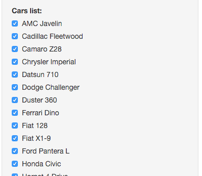
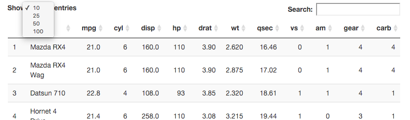

## Car picker UI - Car picker



If you you are already sure that you don't want some car, it might be just out of your budget, unselect it from the car list

---

## Car picker UI - List



Please be carfull while looking onto the results there is limit on the top and you might miss some of the cars.

---

## End 

Thank you for watching it looks like you should have a break it's already

```{r}
Sys.time()
```

